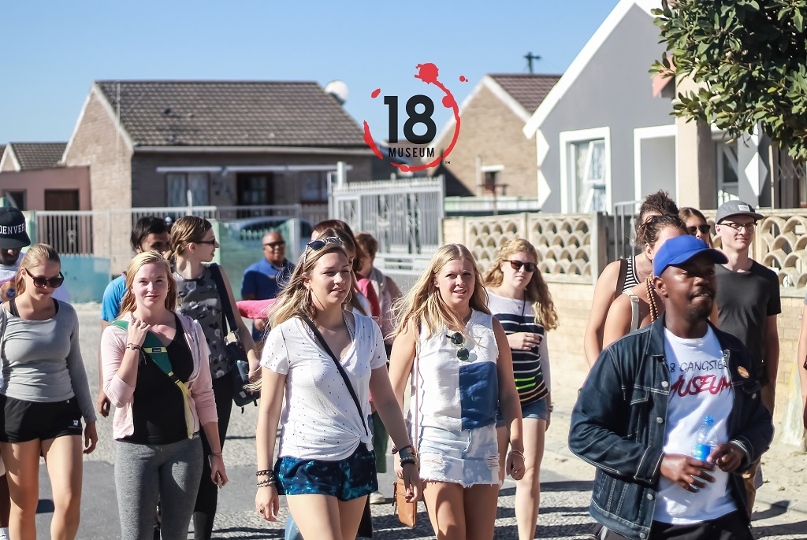

# /images — Asset Guide

Replace placeholder (Unsplash) images with real 18GM photos.

## Required Files

| Filename             | Usage                        | Recommended Size |
|----------------------|------------------------------|------------------|
| `favicon.ico`        | Browser tab icon             | 32×32 px         |
| `og-image.jpg`       | Social media share image     | 1200×630 px      |
| `logo.png`           | Nav logo (transparent bg)    | 300×80 px        |
| `logo-white.png`     | Footer logo (white version)  | 300×80 px        |
| `hero-1.jpg`         | Hero carousel slide 1        | 1920×1080 px     |
| `hero-2.jpg`         | Hero carousel slide 2        | 1920×1080 px     |
| `hero-3.jpg`         | Hero carousel slide 3        | 1920×1080 px     |
| `hero-4.jpg`         | Hero carousel slide 4        | 1920×1080 px     |
| `tour-walking.jpg`   | Walking tour card            | 800×600 px       |
| `tour-cycling.jpg`   | Cycling tour card            | 800×600 px       |
| `tour-party.jpg`     | Party tour card              | 800×600 px       |
| `tour-big7.jpg`      | Big 7 tour card              | 800×600 px       |
| `tour-research.jpg`  | Research tour card           | 800×600 px       |
| `tour-prison.jpg`    | Prison tour card             | 800×600 px       |
| `about-museum.jpg`   | About section photo          | 800×600 px       |
| `gallery-1.jpg` … `gallery-8.jpg` | Media gallery   | 800×800 px       |
| `team-director.jpg`  | Team card photo              | 400×400 px       |
| `team-curator.jpg`   | Team card photo              | 400×400 px       |
| `team-guide.jpg`     | Team card photo              | 400×400 px       |

## Image Optimisation

Compress all images before deployment using [Squoosh](https://squoosh.app) or ImageOptim.

- Hero images: target < 200 KB (WebP preferred)
- Card images: target < 80 KB
- Gallery images: target < 100 KB

## Using Local Images

Once you have the files, replace Unsplash URLs in HTML with local paths:

```html
<!-- Before -->


<!-- After -->

<!-- or from root -->

```

Also update hero carousel `background-image` values in `index.html`:
```html
<div class="hero-slide active" style="background-image: url('images/hero-1.jpg')"></div>
```
